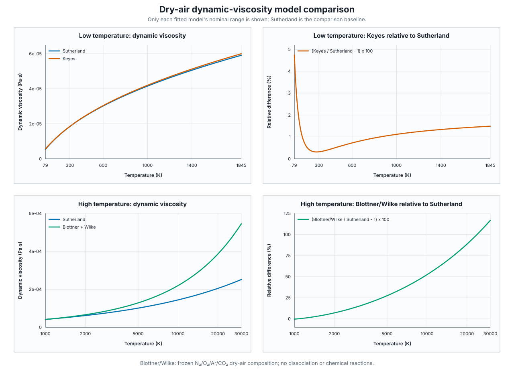

Transport properties
====================

The :mod:`aerophysics.transport` module provides interchangeable,
temperature-dependent dynamic-viscosity models. All models accept temperature
in kelvin and return dynamic viscosity in Pa s. Scalar input returns a Python
``float`` and array-like input returns a float64 NumPy array.

Dynamic-viscosity interface
---------------------------

:class:`~aerophysics.transport.DynamicViscosityModel` is the structural
interface consumed by the boundary-layer APIs. Any object implementing
``dynamic_viscosity(temperature)`` with the documented scalar and array
behaviour can be supplied as ``viscosity_model``.

Sutherland model
----------------

:class:`~aerophysics.transport.SutherlandModel` evaluates

.. math::

   \mu(T)=\mu_\mathrm{ref}
   \left(\frac{T}{T_\mathrm{ref}}\right)^{3/2}
   \frac{T_\mathrm{ref}+S}{T+S}.

``AIR_VISCOSITY`` is the existing dry-air default, with
:math:`\mu_\mathrm{ref}=1.7894\times10^{-5}\ \mathrm{Pa\,s}`,
:math:`T_\mathrm{ref}=288.15\ \mathrm{K}`, and :math:`S=110.4\ \mathrm{K}`.
It remains the model used by the standard atmosphere and flight-condition
calculations. The correlation follows :ref:`Sutherland (1893)
<ref-sutherland-1893>`.

>>> from aerophysics.transport import AIR_VISCOSITY
>>> f"{AIR_VISCOSITY.dynamic_viscosity(300.0):.7e}"
'1.8460219e-05'

Keyes model
-----------

:class:`~aerophysics.transport.KeyesModel` uses

.. math::

   \mu(T)=\frac{a_0T^{3/2}}
   {T+a_1 10^{-a_2/T}}.

``AIR_KEYES_VISCOSITY`` uses :math:`a_0=1.488\times10^{-6}`,
:math:`a_1=122.1\ \mathrm{K}`, and :math:`a_2=5\ \mathrm{K}`. Its nominal
temperature range is 79--1845 K.
See :ref:`Keyes (1951) <ref-keyes-1951>` and the SI reproduction by
:ref:`Bova, Bond, and Kirk (2010) <ref-bova-bond-kirk-2010>`.

>>> from aerophysics.transport import AIR_KEYES_VISCOSITY
>>> f"{AIR_KEYES_VISCOSITY.dynamic_viscosity(300.0):.7e}"
'1.8519327e-05'

Blottner species and mixture models
-----------------------------------

:class:`~aerophysics.transport.BlottnerModel` represents one gas species:

.. math::

   \mu_s(T)=0.1\exp\left[(A_s\ln T+B_s)\ln T+C_s\right].

The nominal fitted range is 1000--30000 K. The built-in frozen dry-air model
uses coefficients from :ref:`Blottner, Johnson, and Ellis (1971)
<ref-blottner-johnson-ellis-1971>` and :ref:`Doraiswamy (2010)
<ref-doraiswamy-2010>`.

.. list-table:: Built-in Blottner coefficients
   :header-rows: 1

   * - Species
     - :math:`A_s`
     - :math:`B_s`
     - :math:`C_s`
   * - N₂
     - 0.0268142
     - 0.3177838
     - -11.3155513
   * - O₂
     - 0.0449290
     - -0.0826158
     - -9.2019475
   * - Ar
     - -0.02201
     - 1.010
     - -13.42
   * - CO₂
     - -0.041372
     - 1.3293
     - -15.016

:class:`~aerophysics.transport.WilkeMixtureViscosityModel` combines species
viscosities using mole fractions :math:`x_i`, molar masses :math:`M_i`, and
Wilke's rule from :ref:`Wilke (1950) <ref-wilke-1950>`:

.. math::

   \mu=\sum_i\frac{x_i\mu_i}{\sum_jx_j\phi_{ij}},
   \qquad
   \phi_{ij}=\frac{\left[1+\left(\frac{\mu_i}{\mu_j}\right)^{1/2}
   \left(\frac{M_j}{M_i}\right)^{1/4}\right]^2}
   {\sqrt{8\left(1+M_i/M_j\right)}}.

``AIR_BLOTTNER_VISCOSITY`` uses the same normalized N₂/O₂/Ar/CO₂ mole
fractions and molar masses as ``AIR_NASA7`` and ``AIR_NASA9``.

>>> from aerophysics.transport import AIR_BLOTTNER_VISCOSITY
>>> f"{AIR_BLOTTNER_VISCOSITY.dynamic_viscosity(1000.0):.7e}"
'4.1375747e-05'

Temperatures outside a Keyes or Blottner nominal range remain computable but
emit :class:`~aerophysics.exceptions.ApplicabilityWarning`. Non-positive or
non-finite temperatures raise ``ValueError``. The Blottner dry-air preset has
fixed composition: it does not model dissociation, reactions, ionization, or
thermodynamic nonequilibrium.

Model comparison
----------------

The following figure and tables compare the correlations with Sutherland as
the baseline. They are a comparison between models, not a validation against
experimental measurements. Each curve and table entry is restricted to the
nominal range of the fitted model being compared: 79--1845 K for Keyes and
1000--30000 K for Blottner. No Keyes or Blottner extrapolation is included.

         Blottner/Wilke dry-air dynamic-viscosity models
   :width: 100%

   Dynamic-viscosity model comparison. Relative difference is
   :math:`(\mu_\mathrm{model}/\mu_\mathrm{Sutherland}-1)\times100\%`.
   The Blottner curve is the Wilke mixture of fixed N₂/O₂/Ar/CO₂ mole
   fractions; it does not represent dissociating or reacting high-temperature
   air.

.. include:: ../_generated/viscosity_model_comparison.rst

The interval 1000--1845 K is common to all three nominal ranges. Across its
endpoints, Keyes is 1.118--1.489% above Sutherland. Blottner/Wilke changes
from 0.353% below Sutherland at 1000 K to 5.835% above it at 1845 K. This
shared interval permits a direct three-model comparison without evaluating a
fitted model outside its stated range.

The checked-in SVG and table fragment are generated from the public model API
with NumPy and the standard library only. Regenerate them, or verify that they
are current, with:

.. code-block:: console

   $ python docs/scripts/generate_viscosity_comparison.py
   $ python docs/scripts/generate_viscosity_comparison.py --check

Thermal conductivity
--------------------

:class:`~aerophysics.transport.USSAConductivityModel` evaluates the U.S.
Standard Atmosphere correlation

.. math::

   k(T)=\frac{c_kT^{3/2}}{T+A_k10^{-B_k/T}},

with :math:`c_k=2.64638\times10^{-3}`, :math:`A_k=245.4\ \mathrm{K}`, and
:math:`B_k=12\ \mathrm{K}` for ``AIR_CONDUCTIVITY``. The result is in W/(m K).

The conductivity equation and coefficients follow
:ref:`U.S. Standard Atmosphere 1976 <ref-us-standard-atmosphere-1976>`.
Primary-source implementation checks and the separate physical-accuracy
assessment against the NIST evaluated dilute-air correlation are recorded in
:doc:`../verification/thermophysical`.
