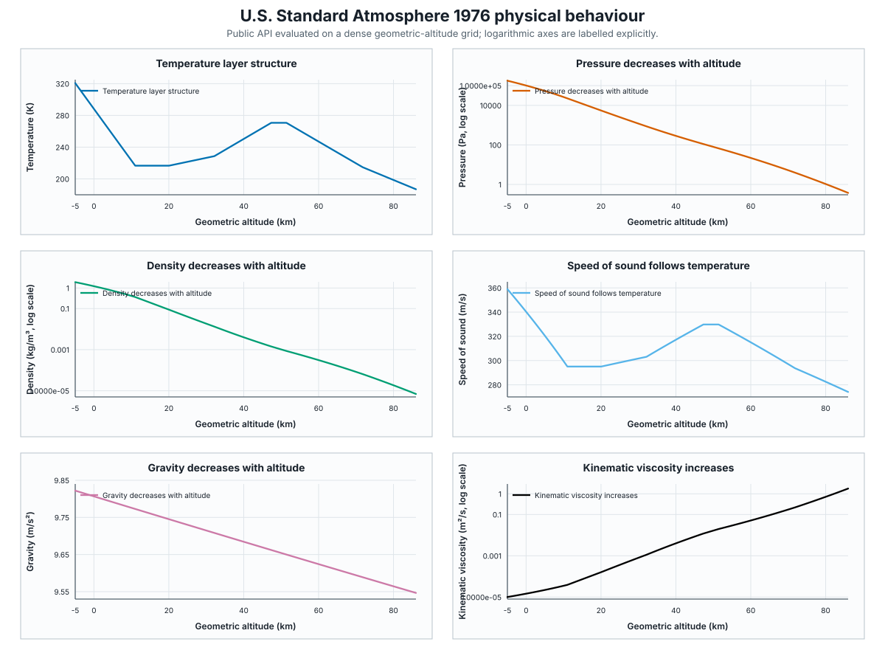
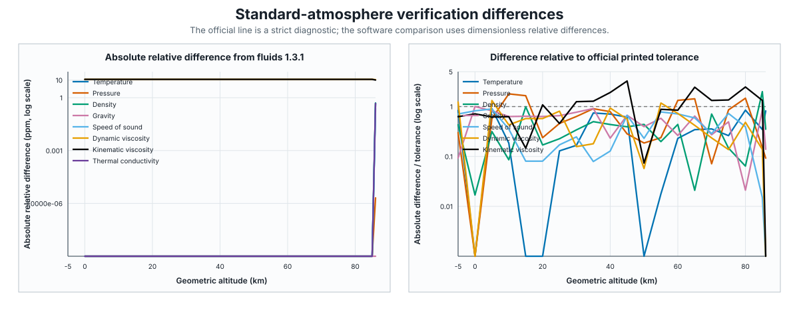

Verification
============

This chapter records reproducible checks of the equations implemented by
``aerophysics``.  A verification result establishes agreement with a stated
reference or mathematical property; it is not a substitute for experimental
validation.  The first record covers
:func:`aerophysics.atmosphere.standard_atmosphere` and all fifteen fields of
:class:`aerophysics.atmosphere.AtmosphereState`.

U.S. Standard Atmosphere 1976
-----------------------------

Scope and sources
^^^^^^^^^^^^^^^^^

The primary source is *U.S. Standard Atmosphere, 1976*, NOAA-S/T 76-1562,
NASA-TM-X-74335.  The source PDF is kept locally for review but is not tracked
by Git.  Values needed by offline tests are independently transcribed to
``tests/reference_data/standard_atmosphere/official_1976.csv`` with their
table number, printed page, coordinate type, SI value, and absolute
tolerance.

The transcription contains geometric altitudes at -5 km, every 5 km from 0
through 85 km, and the 86 km endpoint.  It also contains the geopotential
layer boundaries at 0, 11, 20, 32, 47, 51, 71, and 84.852 km.  Temperature,
pressure, and density come from Table I; gravity from Table II; and speed of
sound, dynamic viscosity, and kinematic viscosity from Table III.

The errata printed at the end of the report are applied.  In particular, the
thermal-conductivity column in Table III is a factor of 1000 too small and is
therefore not used.  Conductivity is instead checked through the corrected
equation (53), corrected constants, and the corrected sea-level value.  At
86 km the implemented homogeneous model is compared with molecular-scale
temperature ``T_M``; kinetic temperature begins to diverge at that transition.

As an independent software cross-check, the comparison uses
`fluids 1.3.1 <https://pypi.org/project/fluids/1.3.1/>`_, a general-purpose
engineering fluid-dynamics library, through
``fluids.atmosphere.ATMOSPHERE_1976``.  A fixed 0--86 km snapshot at 1 km
intervals is committed as ``fluids-1.3.1.csv``.  Its package version, exact
capture command, variable mapping, and PyPI wheel SHA-256 are recorded in the
adjacent JSON file.  ``fluids`` is neither a runtime nor a CI dependency, and
the snapshot is an independent code-path comparison rather than experimental
ground truth.

Comparison criteria
^^^^^^^^^^^^^^^^^^^

Each official-table cell is accepted using the larger of one final printed
digit or a relative tolerance of ``1e-4``, plus a floating-point guard of
``1e-14 * max(1, abs(reference))``.  This accounts for the limited precision
and occasional truncation in the historical printed tables.  Half of the
final printed digit is retained as a stricter diagnostic, not as the overall
verification decision.  Against ``fluids``, temperature uses an absolute
tolerance of ``1e-4 K`` and every other common quantity uses a relative
tolerance of ``2e-5``.

The full implemented range is also sampled at 1 m spacing.  The tests require:

* pressure, density, and gravity to decrease strictly, and kinematic viscosity
  to increase strictly;
* geopotential layer gradients of -6.5, 0, +1.0, +2.8, 0, -2.8, and
  -2.0 K/km;
* temperature, pressure, density, sound speed, and transport properties to be
  continuous at layer boundaries;
* ``p = rho R T``, ``a^2 = gamma R T``, ``nu = mu/rho``,
  ``Pr = mu cp/k``, ``cp-cv = R``, and ``gamma = cp/cv`` within
  ``rtol=1e-12``;
* the numerical hydrostatic derivative
  ``d(log p)/dH = -g0/(R T)`` within ``rtol=1e-7`` away from boundaries; and
* geometric/geopotential round trips and both public range endpoints to remain
  unchanged.

Results
^^^^^^^

.. include:: _generated/standard_atmosphere_validation.rst

Physical interpretation
^^^^^^^^^^^^^^^^^^^^^^^

The temperature profile follows the seven prescribed lapse-rate layers.
Pressure and density decrease by orders of magnitude under hydrostatic
balance, gravity falls gradually with distance from the Earth's centre, and
kinematic viscosity rises because density falls much faster than dynamic
viscosity changes.

The next figure separates the dimensionless software-relative differences
from differences normalized by each official cell's printed-digit tolerance.
The horizontal line at one in the official panel is the stricter diagnostic
boundary; it is not the overall acceptance boundary.

Known limitations and reproduction
^^^^^^^^^^^^^^^^^^^^^^^^^^^^^^^^^^^

The status is ``Verified`` when all acceptance and diagnostic checks pass,
``Verified with observations`` when acceptance checks pass but a stricter
printed-digit diagnostic does not, and ``Needs revision`` only when an
acceptance, independent-software, or physical-invariant check fails.  Expected
failures for the diagnostic observations remain strict: an unexplained failure
stays visible and a future fix produces an unexpected success until this
record is reviewed.  No observation listed here caused a change to the
production atmosphere model.

Regenerate the committed report fragment and SVGs with::

   python docs/scripts/generate_standard_atmosphere_validation.py

Check that they are current without writing files with::

   python docs/scripts/generate_standard_atmosphere_validation.py --check

The external snapshot is intentionally refreshed only by an explicit command
in an isolated environment::

   uv run --isolated --with fluids==1.3.1 python docs/scripts/capture_fluids_reference.py
