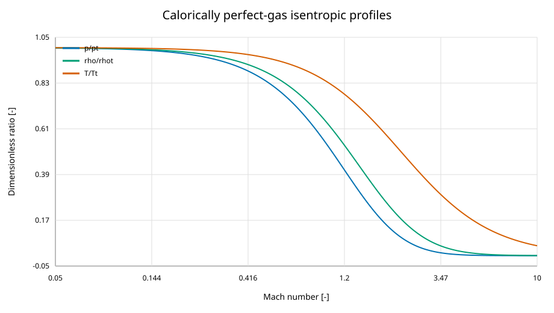
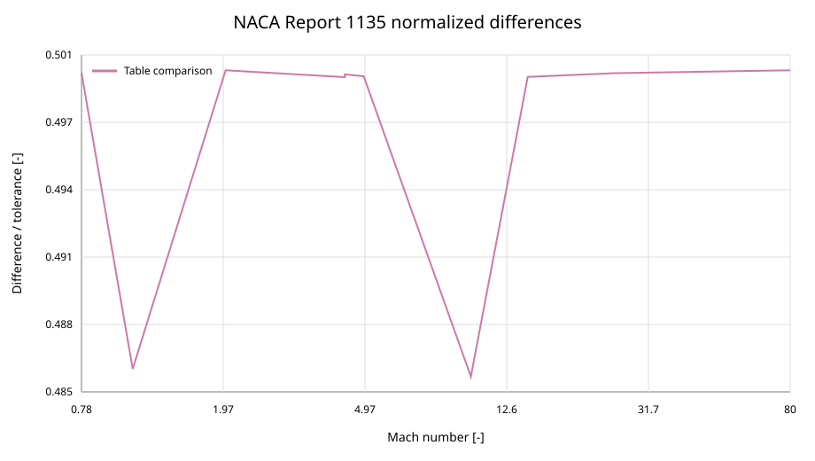

Compressible-flow verification
==============================

Scope
-----

This record covers the public calorically perfect-gas isentropic, normal-shock,
oblique-shock, conical-shock, supersonic-Pitot, and Prandtl--Meyer APIs.  It
also covers the detached-shock correlations and checks the shared isentropic
path used by the temperature-dependent and real-gas models.  Verification
means agreement with the stated mathematical model; it is not experimental
validation of an inviscid-flow approximation.

Primary references
------------------

The primary one-dimensional and shock reference is
:ref:`NACA Report 1135 <ref-naca-report-1135>`. The fixture
contains every Mach abscissa printed in Table I (Mach 0--1) and Table II
(Mach 1--100), the printed page, rounded table values, and the final printed
unit.  Because the public scan contains imperfect OCR, the large table was
reconstructed independently from the equations printed beside the tables and
rounded to the displayed precision.  Page transitions and representative
cells were visually checked against the scan.

Axisymmetric flow is compared with :ref:`NASA SP-3004 <ref-sims-1964>`. The committed
fixture covers every published cone half-angle from 2.5 to 30 degrees for
Mach 1.5, 2, 3, and 5 where the report provides an attached-flow solution.
The source's compact numeric notation is decoded from the PDF text layer;
damaged OCR cells are recovered at the report's eight-significant-digit
precision and checked against adjacent state relations.

Detached-shock formulas are checked directly against
:ref:`Ambrosio--Wortman <ref-ambrosio-wortman-1962>`,
:ref:`Billig <ref-billig-1967>`, and :ref:`Seiff <ref-seiff-1964>` at Mach 2,
4, and 8 for both supported geometries where
applicable.  The coefficients, expected values, citations, coordinate
convention, and NASA TN D-2780 independent Seiff interval are committed in
``tests/reference_data/compressible_flow/detached_shock_sources.json``.  Those
formula-generated cases are supplemented by :ref:`Inouye's
<ref-inouye-1965>` independently tabulated
air sphere solution in NASA TN D-2780, Table I (printed page 10, PDF page 12):
at :math:`M_\infty=8.949`, the numerical solution reports
:math:`\rho_\infty/\rho_2=0.1253` and :math:`\Delta/R_b=0.0994`.  Equation (4)
predicts ``0.097734`` from the printed density ratio.  The ``0.002`` absolute
tolerance includes their ``0.001666`` difference and the table's four-decimal
rounding; the test therefore compares the correlation with a source result
that was not generated from the implemented equation.

Comparison and acceptance
-------------------------

For NACA 1135, each cell is accepted using the larger of one final printed
unit or ``1e-4`` relative difference.  Half a final printed unit remains a
diagnostic.  SP-3004 cells use ``rtol=1e-4`` because the package solves a
boundary-value ODE whereas the report integrated outward from the cone with a
documented finite step.  Algebraic conservation checks use ``rtol=1e-12``;
inverse numerical relations use ``rtol=1e-10``.

Thermally perfect shock verification
----------------------------------------

``tests/test_thermal_shocks.py`` verifies the frozen ideal-gas shock solver
described by :ref:`Tatum (1996) <ref-tatum-1996>`. Constant-heat-capacity NASA
and harmonic models recover the calorically perfect equations. Harmonic
limits cover :math:`\gamma=1.2,1.4,5/3`, Mach 1.2--10, and both angle roots;
normal-state comparisons use ``rtol=2e-10`` and oblique comparisons
``rtol=2e-9``. NASA7, NASA9, and harmonic states on both branches satisfy
mass, normal momentum, total enthalpy, and tangential velocity conservation
with ``rtol=2e-11``. Entropy independently determines the pressure loss.

A manufactured gas with :math:`c_p/R=3.5+0.001T` at Mach 4, 500 K, and a
20-degree turn is independently solved as three simultaneous equations in
shock angle, temperature ratio, and density ratio. Its analytical enthalpy
and entropy integrals avoid the production Hugoniot solver and NASA property
evaluator. Both branches agree within ``2e-11``; coupled-equation residuals
are below ``2e-12``. These are model verification cases, not a comparison
against the printed NASA CR-4749 tables or experimental data.

Additional cases cover broadcasting, sonic and zero-turn limits, detachment,
polynomial-region crossings, near-sonic normal shocks, small deflections,
invalid inputs, and a Mach-20 weak shock that remains within the NASA fit
while its normal shock and attached limit are outside it. GUI tests cover
model selection, static-temperature units, sweeps, and settings replay.

Thermally perfect conical verification
--------------------------------------

``tests/test_thermal_conical.py`` checks the weak conical solution and its
physical attached limit. Constant-cp harmonic models recover the existing
Taylor--Maccoll solver for gamma 1.2, 1.4, and 5/3 at Mach 1.2, 3, and 10;
state comparisons use ``rtol=3e-9`` and ``atol=2e-10``. The existing
calorically perfect SP-3004 comparisons remain unchanged.

An independent reference uses :math:`c_p/R=3.5+0.001T`, Mach 4, 500 K, and
a 15-degree cone. It solves the shock's mass, momentum, and energy equations
simultaneously, then integrates radial velocity, polar velocity, and
temperature with RK45 and analytical caloric properties. This avoids the
production temperature Hugoniot, enthalpy inversion, property evaluator,
and DOP853 integrator. State ratios and Mach number agree within ``rtol=3e-9``;
shock angle agrees within ``2e-10`` rad. A nonzero enthalpy reference offset
also checks that vacuum-velocity normalization is not assumed.

NASA7, NASA9, and harmonic presets satisfy total-enthalpy conservation and
entropy-based total-pressure loss within ``rtol=3e-10``, and the ideal-gas
state-ratio identity within ``rtol=2e-12``. Temperature-range regressions
include valid weak cones with inaccessible normal shocks or attached limits,
and a case whose shock temperature fits the range but surface temperature
does not. Broadcasting, zero-cone limits, physical detachment, and GUI settings
replay are also checked. These are mathematical model verification cases,
not experimental validation of frozen high-temperature air.

Additional review regressions place the temperature boundary only 0.001 K
above or below the surface temperature at the physical maximum, checking
attached-limit availability and range/detachment classification. Slender-cone
inputs exercise successful solutions or typed numerical failure, depending on
the numerical backend. Injected convergence failures test the same 0.1-degree
error/10-degree success sweep and single-calculation GUI contract on every
platform without requiring a particular floating-point failure to occur.

Results
-------

.. include:: ../_generated/compressible_flow_validation.rst

Physical interpretation
-----------------------

Static pressure, density, and temperature fall as Mach number increases at
fixed stagnation conditions.  The area relation has subsonic and supersonic
branches meeting at the sonic throat, and the mass-flow parameter is maximal
there.  Shock calculations conserve mass, momentum, and energy while losing
total pressure.  Detached-shock standoff decreases toward the finite
high-Mach correlation limit, and the Billig shape is symmetric about its
vertex axis.  Prandtl--Meyer angle increases monotonically with Mach.

Limitations and reproduction
----------------------------

Five representative weak-branch readings from NACA Charts 2--4 are checked at
their recorded chart-resolution tolerances.  The stricter oblique-shock test
uses the exact theta--beta--Mach equation and normal-component closure.  The
SP-3004 comparison is limited to the four planned Mach numbers.  Thermally
perfect and real-gas property verification is recorded separately in
:doc:`thermophysical`.

Regenerate this section with::

   python docs/scripts/generate_compressible_flow_validation.py

Check committed artifacts without writing with::

   python docs/scripts/generate_compressible_flow_validation.py --check
