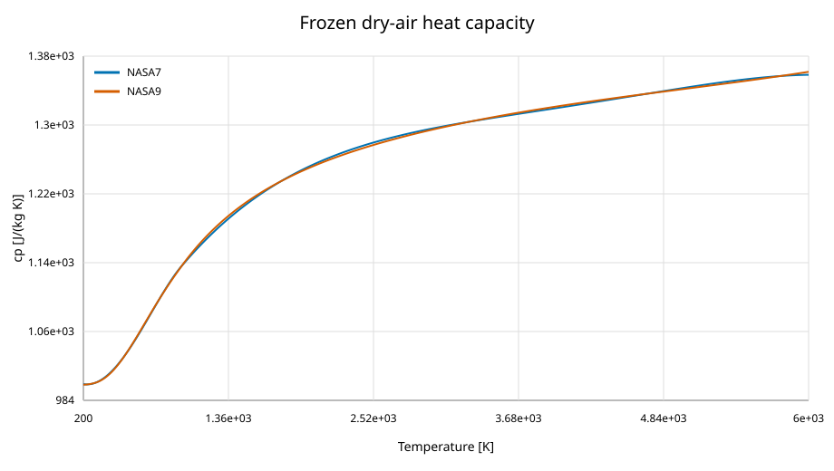
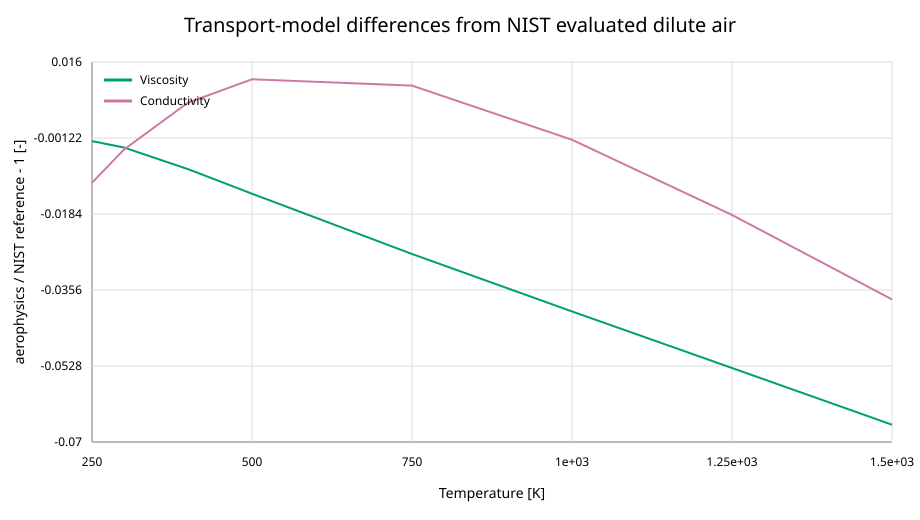

Thermophysical verification
===========================

Scope and source hierarchy
--------------------------

This record covers ``PerfectGas``, NASA seven- and nine-coefficient frozen-air
thermochemistry, Sutherland, Keyes, Blottner/Wilke and USSA transport models,
the harmonic-oscillator gas, and the Beattie--Bridgeman air model.

NASA7 coefficients are pinned to the :ref:`Cantera NASA gas data
<ref-cantera-nasa-gas-data>` and trace to :ref:`NASA TM-4513
<ref-mcbride-gordon-reno-1993>`. NASA9 coefficients are pinned to
:ref:`NASA CEA <ref-nasa-cea-data>` and trace to :ref:`NASA/TP-2002-211556
<ref-mcbride-zehe-gordon-2002>`. The harmonic-oscillator and
Beattie--Bridgeman constants follow :ref:`Watari (2007)
<ref-watari-2007-report>` and the original sources :ref:`Kennard (1938)
<ref-kennard-1938>` and :ref:`Beattie and Bridgeman (1928)
<ref-beattie-bridgeman-1928>`. Transport provenance is linked directly from
:doc:`../models/transport_properties`.

Cross-implementation thermochemistry
------------------------------------

`Cantera 3.2.0 <https://pypi.org/project/cantera/3.2.0/>`_ evaluates the same
frozen composition at 13 temperatures from 200 to 6000 K.  The snapshot stores
``cp``, standard enthalpy, entropy, heat-capacity ratio, and sound speed.
Cantera entropy is normalized from its 1-atm standard state to the NASA 1-bar
reference used by the package.  The acceptance threshold is ``rtol=2e-6``.

Cantera is not a runtime or CI dependency.  Its version, capture command,
variable mapping, and wheel SHA-256 are committed beside the static CSV.

Primary transport references
----------------------------

Sutherland viscosity is checked against the transcribed Table III cells from
:ref:`U.S. Standard Atmosphere 1976 <ref-us-standard-atmosphere-1976>`.  The
USSA conductivity equation is checked against the sea-level value printed in
the report's appended errata.  The Table III conductivity column is not used:
the errata identifies its exponent as a factor-of-1000 error, and its sea-level
mantissa also disagrees with Equation (53).  Direct reproductions of the
published Sutherland, Keyes, Blottner/Wilke, and corrected USSA equations
provide multi-temperature implementation checks.

Evaluated physical-accuracy reference
-------------------------------------

:ref:`Lemmon and Jacobsen (2004) <ref-lemmon-jacobsen-2004>` provide NIST
evaluated correlations for dry-air viscosity and thermal conductivity.  The
committed reference values reproduce their dilute-gas Equations (2) and (5)
at zero density from 250 to 1500 K.  The generator is anchored to the 100 K
and 300 K air values printed in Table V.  This comparison assesses the
physical accuracy of the simpler package correlations; it is deliberately
excluded from the pass/fail decision.  The NIST source estimates 1% uncertainty
for dilute-air viscosity above 200 K and 2% for dilute-gas conductivity.

Results
-------

.. include:: ../_generated/thermophysical_validation.rst

Physical checks and limitations
-------------------------------

Dense grids check ``cp-cv=R``, ``gamma=cp/cv``, ``dh/dT=cp``, coefficient-region
continuity, isentropic entropy and total-enthalpy conservation, positive
Beattie--Bridgeman isothermal stiffness, and pressure-root closure.  Fixed
source-equation values separately audit the Sutherland, Keyes,
Blottner/Wilke, and corrected USSA conductivity formulas and constants.  The
NIST differences describe physical model accuracy rather than implementation
correctness.  The real-gas checks cover the documented 400--2000 K and
1--10 MPa range; they do not claim equilibrium chemistry or comprehensive
experimental validation.

Regenerate with::

   python docs/scripts/generate_thermophysical_validation.py

Rebuild the transport source-equation fixture with::

   python docs/scripts/build_transport_reference.py

Regenerate the NIST evaluated-reference fixture with::

   python docs/scripts/generate_nist_transport_reference.py

Refresh external snapshots only in isolated environments::

   uv run --isolated --with cantera==3.2.0 python docs/scripts/capture_cantera_reference.py
