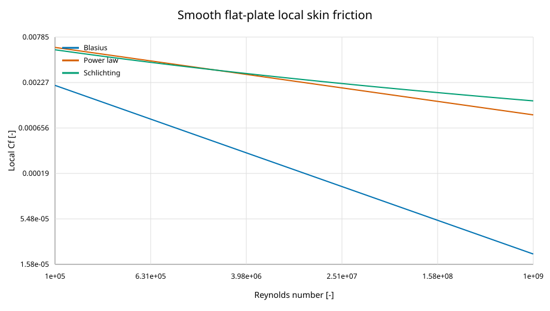
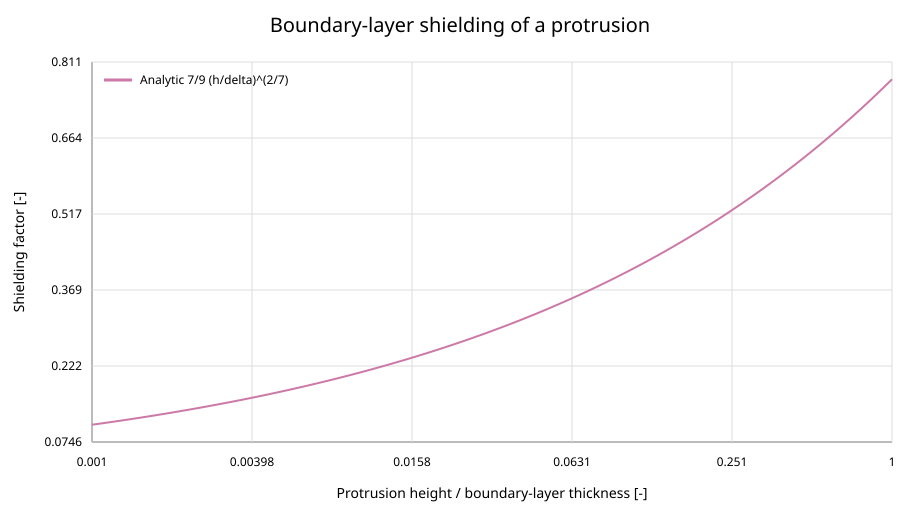

Viscous-flow verification
=========================

Scope and method
----------------

This record covers smooth flat-plate boundary-layer correlations, Eckert and
Van Driest II compressibility paths, Van Driest and Volpiani velocity-profile
transformations, the Spalding--Coles composite profile, GRA/Walz temperature
closures, and boundary-layer-immersed protrusion integration.

The Blasius, one-fifth-power, and Schlichting results are compared with a
fixed CSV independently evaluated from their published equations over Reynolds
numbers ``1e5`` through ``1e9``.  NACA TN-3811 and NASA TN D-6945 are the
primary chart references for Van Driest II.  Three representative points from
NASA TN D-6945 Figure 3(e) are digitized at ``Re_x=1e6``, ``T_e=222 K``, and
``T_w/T_aw=0.6``.  Their pointwise absolute tolerance records line thickness,
the smallest readable chart increment, and scan-reading uncertainty.  Exact
equation and limit checks remain the tighter implementation tests.

Results
-------

.. include:: ../_generated/viscous_flow_validation.rst

Interpretation and model validation boundary
--------------------------------------------

Skin friction decreases with Reynolds number in all three smooth-plate
correlations.  The constant-property Van Driest transform reduces to the
ordinary wall variables, and Van Driest II approaches its dedicated
incompressible correlation as Mach tends to zero.  For a constant-width
protrusion in a one-seventh-power velocity profile, direct integration gives
``7/9 (h/delta)^(2/7)`` while the protrusion remains inside the boundary layer.

These checks verify that the empirical equations and numerical integrals were
implemented as stated.  They do not establish that an empirical correlation
is accurate for every roughness, pressure gradient, wall-temperature ratio,
or three-dimensional protrusion.  In particular, protrusion ``C_D`` is an
input rather than a correlation supplied by this package.

Regenerate or check with::

   python docs/scripts/generate_viscous_flow_validation.py
   python docs/scripts/generate_viscous_flow_validation.py --check
