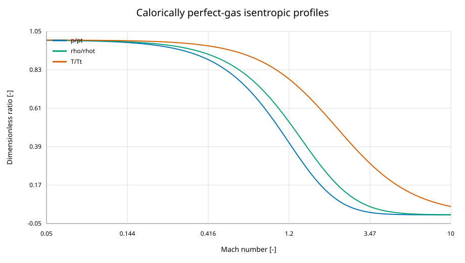
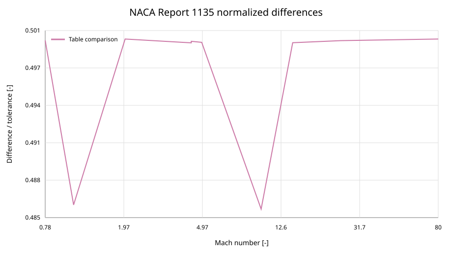

Compressible-flow verification
==============================

Scope
-----

This record covers the public calorically perfect-gas isentropic, normal-shock,
oblique-shock, conical-shock, supersonic-Pitot, and Prandtl--Meyer APIs.  It
also covers the detached-shock correlations and checks the shared isentropic
path used by the temperature-dependent and real-gas models.  Verification
means agreement with the stated mathematical model; it is not experimental
validation of an inviscid-flow approximation.

Primary references
------------------

The primary one-dimensional and shock reference is NACA Report 1135,
*Equations, Tables, and Charts for Compressible Flow* (1953).  The fixture
contains every Mach abscissa printed in Table I (Mach 0--1) and Table II
(Mach 1--100), the printed page, rounded table values, and the final printed
unit.  Because the public scan contains imperfect OCR, the large table was
reconstructed independently from the equations printed beside the tables and
rounded to the displayed precision.  Page transitions and representative
cells were visually checked against the scan.

Axisymmetric flow is compared with NASA SP-3004, *Tables for Supersonic Flow
Around Right Circular Cones at Zero Angle of Attack* (1964).  The committed
fixture covers every published cone half-angle from 2.5 to 30 degrees for
Mach 1.5, 2, 3, and 5 where the report provides an attached-flow solution.
The source's compact numeric notation is decoded from the PDF text layer;
damaged OCR cells are recovered at the report's eight-significant-digit
precision and checked against adjacent state relations.

Detached-shock formulas are checked directly against Ambrosio--Wortman,
Billig, and Seiff at Mach 2, 4, and 8 for both supported geometries where
applicable.  The coefficients, expected values, citations, coordinate
convention, and NASA TN D-2780 independent Seiff interval are committed in
``tests/reference_data/compressible_flow/detached_shock_sources.json``.

Comparison and acceptance
-------------------------

For NACA 1135, each cell is accepted using the larger of one final printed
unit or ``1e-4`` relative difference.  Half a final printed unit remains a
diagnostic.  SP-3004 cells use ``rtol=1e-4`` because the package solves a
boundary-value ODE whereas the report integrated outward from the cone with a
documented finite step.  Algebraic conservation checks use ``rtol=1e-12``;
inverse numerical relations use ``rtol=1e-10``.

Results
-------

.. include:: _generated/compressible_flow_validation.rst

Physical interpretation
-----------------------

Static pressure, density, and temperature fall as Mach number increases at
fixed stagnation conditions.  The area relation has subsonic and supersonic
branches meeting at the sonic throat, and the mass-flow parameter is maximal
there.  Shock calculations conserve mass, momentum, and energy while losing
total pressure.  Detached-shock standoff decreases toward the finite
high-Mach correlation limit, and the Billig shape is symmetric about its
vertex axis.  Prandtl--Meyer angle increases monotonically with Mach.

Limitations and reproduction
----------------------------

Five representative weak-branch readings from NACA Charts 2--4 are checked at
their recorded chart-resolution tolerances.  The stricter oblique-shock test
uses the exact theta--beta--Mach equation and normal-component closure.  The
SP-3004 comparison is limited to the four planned Mach numbers.  Thermally
perfect and real-gas property verification is recorded separately in
:doc:`verification_thermophysical`.

Regenerate this section with::

   python docs/scripts/generate_compressible_flow_validation.py

Check committed artifacts without writing with::

   python docs/scripts/generate_compressible_flow_validation.py --check
